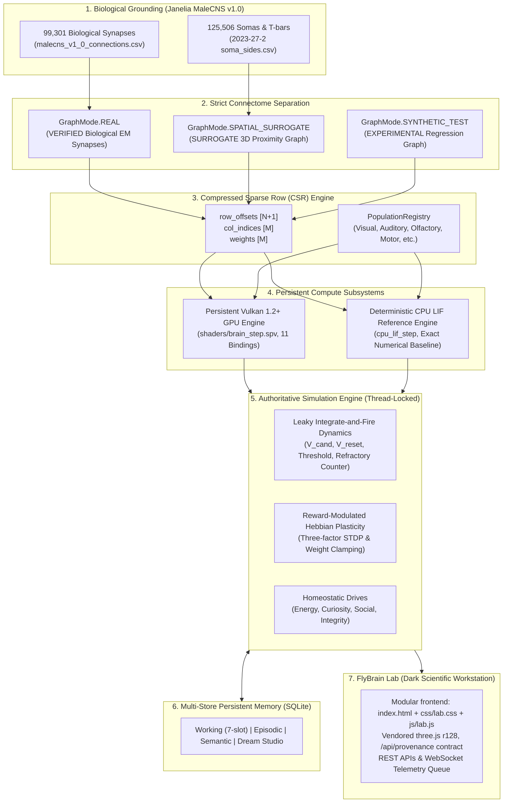

# FlyBrain Architectural Specification & Technical Manual

**Authoritative Architecture Document**
**Version:** 4.1.0
**Target Platform:** Microsoft Windows 11 Pro 64-bit | Vulkan 1.2+ Compute  
**Biological Basis:** Janelia FlyEM *Drosophila* Male Central Nervous System (`male-cns:v1.0`)

---

## 1. System Architecture Overview

FlyBrain is a real, local, Windows 11 compatible, Vulkan-first artificial organism research platform. It grounds neural computation in authentic biological connectomic data from Janelia Research Campus, computing biophysical neural dynamics across high-throughput GPU compute pipelines while maintaining strict provenance contracts.



---

## 2. Strict Connectome Separation: Real vs. Surrogate vs. Synthetic

To guarantee technical rigor and scientific honesty, connectome networks in FlyBrain are strictly separated into three isolated modes governed by `src/connectome/types.py`:

### `GraphMode.REAL` (Status: `VERIFIED`, canonical identity `REAL_SUBGRAPH`)
- **Biological Source:** Bounded sampled subgraph of the authentic Janelia MaleCNS v1.0 biological synaptic connection table (`malecns/data-raw/malecns_v1_0_connections.csv`): 99,301 rows across 2,045 unique bodies in the source; each live circuit samples N neurons / M edges (hub-biased `REAL_HUB_SUBGRAPH`, exact counts in `provenance_metadata` and `/api/provenance`). `REAL_FULL` is explicitly unavailable and raises rather than silently substituting.
- **Characteristics:** Contains only empirical EM-reconstructed edges among the sampled circuit. A sampled neuron with no in-sample biological edge stays disconnected: REAL mode never receives invented fallback edges (regression-tested in `tests/test_provenance.py`).
- **Topology:** Sparse, non-symmetric, heavy-tailed degree distribution with natural biological recurrent loops and modular clustering.
- **Invariants:** Every edge represents an empirical electron microscopy reconstructed synapse.

### `GraphMode.SPATIAL_SURROGATE` (Status: `SURROGATE`)
- **Biological Source:** 125,506 empirical somas, hemilateral sides, and presynaptic T-bar capacities (`malecns/data-raw/2023-27-2 soma_sides.csv`).
- **Characteristics:** Connects neurons using 3D Euclidean spatial proximity via a balanced k-d tree. Synaptic capacities are scaled by presynaptic T-bars.
- **Contract:** Labeled strictly as `SURROGATE` in all telemetry, APIs, and manifests. Never presented as authentic biological synaptic pairs. Surrogate edges cannot enter `REAL` mode (loader raises instead of falling back).

Population (functional-group) assignments in all modes are coordinate heuristics, explicitly flagged `heuristic: true`, `classification_method: coordinate_heuristic`, `annotation_status: no_em_annotation_available`, and can never carry `VERIFIED` status (`tests/test_provenance.py`).

### `GraphMode.SYNTHETIC_TEST` (Status: `EXPERIMENTAL`)
- **Characteristics:** Deterministic synthetic network generated with explicit recurrent loops and input/output pathways.
- **Purpose:** Used for high-speed automated regression testing, mathematical invariance verification, and headless CI/CD runs.

---

## 3. Biophysical Neural Dynamics: Classical LIF Formulation

FlyBrain implements genuine classical Leaky Integrate-and-Fire (LIF) dynamics across both its GLSL compute shaders and CPU reference engines.

### 3.1 Mathematical Formulation
For each neuron $i \in \{0, \dots, N-1\}$ at simulation step $t$:

**Unit contract:** normalized simulation units by default ($\lambda=0.85$, $V_{\text{thresh}}=1.0$,
$V_{\text{reset}}=0.0$, $V_{\text{rest}}=0.0$, $t_{\text{ref}}=2$). Millivolt semantics are obtained
by passing explicit parameters with the reference mapping $V_{\text{norm}} = (V_{\text{mV}} + 70.0)/20.0$
(rest $-70$ mV $\to 0.0$, threshold $-50$ mV $\to 1.0$). CPU (`cpu_lif_step`), Vulkan shader
(`brain_step.comp`), and runtime use exactly these parametrized semantics; parity is validated,
not assumed (`tests/test_lif.py`, `validate-vulkan`, max diff $< 1.79 \times 10^{-7}$).

1. **Synaptic Current Summation:**
   $$I_{\text{syn}, i}(t) = \sum_{j \in \text{Pre}(i)} W_{ij} \cdot S_j(t-1)$$
   where $W_{ij}$ is the synaptic conductance weight and $S_j(t-1) \in \{0.0, 1.0\}$ is the presynaptic binary spike event.

2. **Absolute Refractory Period Check:**
   If the refractory step counter $R_i(t-1) > 0$:
   $$R_i(t) = R_i(t-1) - 1$$
   $$V_i(t) = V_{\text{reset}}$$
   $$S_i(t) = 0.0$$
   The neuron is inhibited from integrating synaptic currents or emitting action potentials.

3. **Subthreshold Leaky Integration:**
    If $R_i(t-1) == 0$:
    $$V_{\text{cand}, i} = V_{\text{rest}} + \left(V_i(t-1) - V_{\text{rest}}\right) \cdot \lambda + I_{\text{syn}, i}(t) + I_{\text{ext}, i}(t)$$
    where $\lambda$ is the membrane leak factor (default $0.85$).

4. **Action Potential Threshold & Hard Reset:**
   If $V_{\text{cand}, i} \ge V_{\text{thresh}}$ (typically $-50.0 \text{ mV}$ or normalized $1.0$):
   $$S_i(t) = 1.0$$
   $$V_i(t) = V_{\text{reset}}$$
   $$R_i(t) = t_{\text{ref}} \quad (\text{default: } 2 \text{ steps})$$
   Otherwise:
   $$S_i(t) = 0.0$$
   $$V_i(t) = \max\left(V_{\text{cand}, i}, V_{\text{reset}} - 1.0\right)$$
   $$R_i(t) = 0$$

### 3.2 Vulkan Compute Shader Descriptor Layout (`shaders/brain_step.comp`)
The compute pipeline binds 11 persistent storage buffers under `set = 0`:

| Binding | Buffer Name | Type | Access | Description |
| :---: | :--- | :---: | :---: | :--- |
| `0` | `RowOffsets` | `int[]` | Readonly | CSR row pointers $[0 \dots N]$ |
| `1` | `ColIndices` | `int[]` | Readonly | CSR column indices $[0 \dots M-1]$ |
| `2` | `Weights` | `float[]` | Readonly | Synaptic weights $[0 \dots M-1]$ |
| `3` | `PrevSpikes` | `float[]` | Readonly | Previous binary spikes $S(t-1) \in \{0.0, 1.0\}$ |
| `4` | `ExternalInputs` | `float[]` | Readonly | External sensory stimulation currents $I_{\text{ext}}$ |
| `5` | `PotentialsIn` | `float[]` | Readonly | Input membrane potentials $V(t-1)$ |
| `6` | `RefractoryIn` | `int[]` | Readonly | Input refractory step counters $R(t-1)$ |
| `7` | `PotentialsOut` | `float[]` | Writeonly | Updated membrane potentials $V(t)$ |
| `8` | `SpikesOut` | `float[]` | Writeonly | Emitted binary action potentials $S(t)$ |
| `9` | `RefractoryOut` | `int[]` | Writeonly | Updated refractory counters $R(t)$ |
| `10` | `BrainParams` | Struct | Readonly | Scalar parameters: $N, \lambda, V_{\text{thresh}}, V_{\text{reset}}, V_{\text{rest}}, t_{\text{ref}}$ |

---

## 4. Persistent GPU Architecture & Resource Lifecycle

Unlike naive implementations that reallocate buffers and rebuild pipelines on every simulation tick, `VulkanComputeEngine` (`src/compute/vulkan_backend.py`) implements a persistent resource architecture:

1. **Capability-Based Device Selection:**
   - Evaluates physical devices using queue family compute flags and device types:
     $$\text{Score} = \begin{cases} 100 & \text{VK\_PHYSICAL\_DEVICE\_TYPE\_DISCRETE\_GPU} \\ 50 & \text{VK\_PHYSICAL\_DEVICE\_TYPE\_INTEGRATED\_GPU} \\ 10 & \text{VK\_PHYSICAL\_DEVICE\_TYPE\_CPU} \end{cases}$$
   - Automatically binds to discrete GPU if present, otherwise integrated GPU (AMD Radeon 680M verified).

2. **Persistent GPU-Resident State:**
   - Buffers for CSR structures, potentials, spikes, and refractory counters are allocated once during circuit initialization.
   - Per-step execution incurs zero `vkAllocateMemory`, `vkCreateBuffer`, `vkCreateComputePipelines`, or `vkAllocateDescriptorSets` calls.
   - Ping-pong synchronization is achieved via single-submit persistent command buffers and memory pipeline barriers (`VK_PIPELINE_STAGE_COMPUTE_SHADER_BIT`).

3. **Synaptic Plasticity Pipeline (`shaders/plasticity.comp`):**
     - Implements the documented three-factor reward-modulated Hebbian rule identically on CPU and GPU:
       $$\Delta W_{ij} = \eta \cdot r \cdot \left(A_{\text{pre}, j} \cdot A_{\text{post}, i} - \beta \cdot W_{ij}\right)$$
       with $\eta=0.05$, $\beta=0.01$, clamp $[0.01, 1.0]$. The shader resolves the postsynaptic
       (CSR row-owner) neuron per synapse via binary search; the runtime feeds identical
       pre/post spikes to both paths (12-step trajectory parity: spikes exact, weights $< 2 \times 10^{-8}$).
     - Operates in-place on the GPU-resident `Weights` buffer. Since v4.1 the
       CPU weight mirror syncs lazily (`BrainRuntime.sync_gpu_weights()`,
       auto-called by `save_snapshot()` and the experiment manager before
       final hashing); per-step weight readback was removed by measurement
       (see `diagnostics/benchmark_report.json`).

---

## 5. Authoritative Single Simulation Engine & Telemetry Isolation

Concurrency is strictly managed by `SimulationEngine` (`src/brain/simulation_engine.py`):

- **Single Threaded Master Loop:** Background thread (`FlyBrainSimWorker`) is the sole entity modifying the brain runtime state.
- **Reentrant Locking:** Thread-safe `threading.RLock` protects all reads and writes against race conditions.
- **Non-Invasive Telemetry Queue:** Light-weight metric snapshots are dispatched non-blockingly to registered async WebSocket queues (`asyncio.Queue`), ensuring web clients and dashboards never stall simulation steps.

---

## 6. Deterministic Experimentation & Provenance Tracking

Experiments in FlyBrain are completely reproducible and tracked cryptographically by `ExperimentManager` (`src/experiment/manager.py`):

- Every experiment records:
  - Seed, graph mode, neuron count, duration steps
  - SHA-256 hashes of soma and connection raw biological files
  - SHA-256 hashes of compiled SPIR-V compute shaders
  - Exact Git commit SHA
  - Hardware device identifier and driver version
  - Initial 256-bit SHA-256 state hash
  - Final 256-bit SHA-256 state hash
  - Serialized `.npz` brain state snapshot
- Bit-exact replication is verified across independent runs via:
  ```bash
  flybrain experiment verify --result <experiment_id>
  ```

---

## 7. Automated Acceptance Matrix & Verification

Release readiness is enforced by the canonical acceptance schema
(`verification/acceptance_schema.json`, profiles: workstation, cpu-only,
vulkan, ci, huggingface, release) evaluated by
`scripts/run_acceptance_matrix.py`:

```bash
flybrain acceptance-matrix
```

Every category evaluates behavioral assertions to `PASS`/`SKIP_ENVIRONMENT`
(`SKIP` only for genuinely missing capabilities, with explicit reason; 0
`FAIL` required for release). Totals in README, RESEARCH_STATUS, and release
notes are generated from `diagnostics/acceptance_matrix.json` by
`scripts/render_status_tables.py` — never hand-copied.

---

## 8. Embodied 3D World (V6)

Layered on top of, never inside, the biological core:

```text
World3D (spec/clock/objects) -> PhysicsWorld (MuJoCo, authoritative)
  -> Body3D (physiology) -> EyeSensor (raycast GEOMETRIC perception)
  -> BrainRuntime (LIF) -> AutonomyEngine (goals) -> typed actions
  -> drive servo -> solver -> contacts/outcomes -> reward
  -> episodic + spatial/visual memory (SQLite + local MiniLM RAG)
```

- TRUE_WORLD (spec + solver state) vs ORGANISM_KNOWLEDGE (known maps,
  memories) strictly separated; cognition receives observations only.
- Character = dynamic capsule + head (single rigid body), planar velocity
  servo, gravity free, attitude PD + get-up maneuver, fall-impact damage.
- Friends are full EmbodiedAgents; trust emerges from measured teach()
  sessions (never initialized).
- Heavy AI (LLM/VLM/STT/TTS/image) is event-driven via ModelManager
  (pressure shedding); physics/ticks never wait for models.
- World backups extend the V5 envelope (world_snapshot.json + spatial.db +
  model registry metadata; binaries never duplicated).
- API: `/api/v1/world/*`, `/api/v1/models`; UI: WORLD tab (render-only
  Three.js, 4 cameras, minimap).

## 9. Artificial-Life Layer
On top of the connectome core sits a small-scale, CPU-run artificial-life stack (details + honest
status split in `docs/alife_architecture.md`):

- `src/common/`: seed bundles, SHA-256 stable IDs, 26-type event sourcing, state hashing.
- `src/genome/`: versioned genome schema v1.0 with deterministic mutation/crossover + provenance records.
- `src/development/`: neurogenesis → differentiation → migration → axon/dendrite growth →
  synaptogenesis → pruning → apoptosis, with graph-invariant validation after every operation.
- `src/world/` + `src/organism/`: deterministic grid world (grazing, hazards, tracked regrowth influx)
  and organisms with lifecycle stages, metabolism books, and sleep/dream replay of real episodes.
- `src/population/` + `src/culture/`: overlapping generations, sexual/asexual reproduction with energy
  costs, Pareto selection, teacher→student transmission with measured gain and provenance chains.
- `src/agents/protocols.py`: deterministic scripted teacher (cultural channel only); the LLM teacher
  slot raises `MODEL_UNAVAILABLE` instead of faking inference.
- Canonical experiment `scripts/run_alife_experiment.py --population 10 --ticks 150 --seed 7`:
  8 living, 4 births, 6 deaths, generations `[0, 1]` coexisting, 131 teaching sessions,
  bit-exact replay verified (`--verify`).
- Live colony data API: `/api/colony`, `/api/colony/organism/{id}`, `/api/colony/lineage`
  (serves real simulation state; no fabricated metrics).
